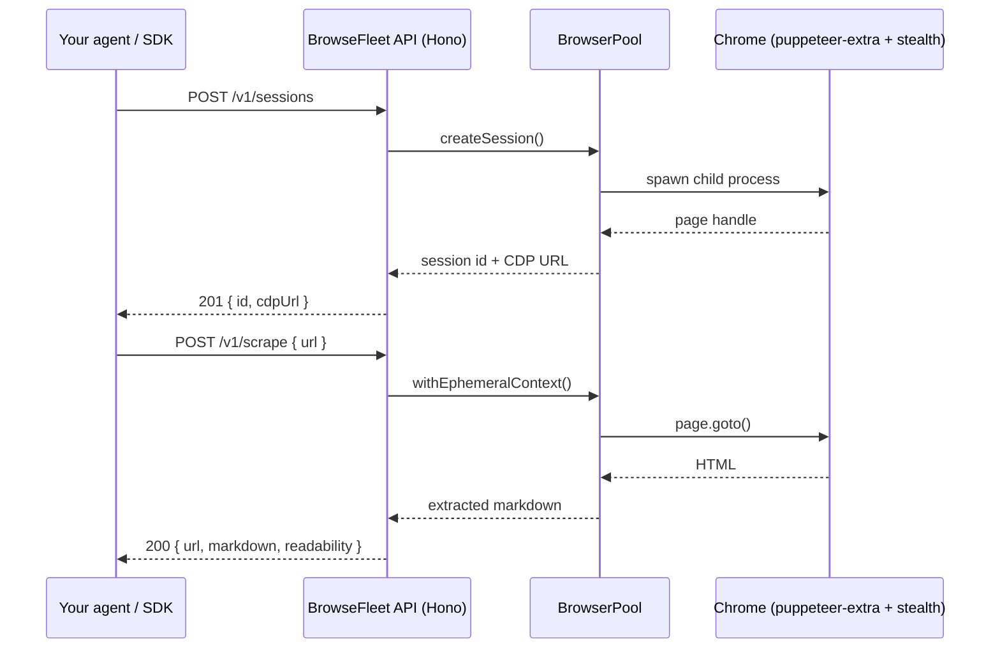

# BrowseFleet

Self-hosted cloud browser API for AI agents. Sessions, scraping, screenshots, PDF, stealth, profile persistence, and human-in-the-loop control behind one REST endpoint you operate.

[](./LICENSE)
[](./.nvmrc)
[](https://github.com/theRJMurray/browsefleet/issues)
[](https://github.com/theRJMurray/browsefleet)

BrowseFleet runs a fleet of stealthed headless Chrome instances behind a single REST API. Agents and automation code spin up sessions, control them over the Chrome DevTools Protocol, scrape pages, screenshot, generate PDFs, persist profiles, and tear sessions down again, all from one HTTP host you run.

It is open source, MIT licensed, and ships with zero phone-home behavior. You host it.

> **Working in this repo with an AI agent?** Read [`skill.md`](./skill.md) first. It teaches Claude Code, Cursor, Aider, or any coding agent how to set up, run, test, and contribute to this repo with no further instruction.

## Quick start

```bash
docker run -p 3000:3000 --shm-size=2g ghcr.io/therjmurray/browsefleet:latest
# in another terminal:
curl -X POST localhost:3000/v1/scrape \
  -H 'Content-Type: application/json' \
  -d '{"url":"https://example.com"}'
```

That is the entire integration. Add `API_KEYS=key1,key2` and an `x-api-key` header once you take this off localhost.

> The public Docker image is published as part of Phase 3 of the OSS arc. Until then, build locally: `docker build -t browsefleet . && docker run -p 3000:3000 --shm-size=2g browsefleet`. See [`skill.md`](./skill.md) for the full local dev path.

## Features

- **REST + CDP.** High-level endpoints for the common case (scrape, screenshot, pdf). Direct CDP WebSocket proxy for everything else.
- **Stealth.** `puppeteer-extra-plugin-stealth` baked in. Per-session randomized viewport, user agent, and platform.
- **Persistent profiles.** Reuse a Chrome user-data directory across sessions. Useful for any flow that needs to stay logged in.
- **Operator mode.** Sessions can start in `human` control, let a real person log in, then hand off to an agent. State machine: `agent` / `human` / `paused`.
- **AI agent layer.** Built-in vision-based agent (`/v1/agent`) that takes a natural-language task and drives the browser using Claude or GPT.
- **CAPTCHA solving.** Plug a 2captcha key into `.env` and call `/v1/sessions/:id/captcha/solve`.
- **Self-hosting friendly.** One Node process, one SQLite file, one Docker container. No Redis, no Postgres, no external queue.
- **Honest authentication.** Timing-safe API key check, per-key and per-IP rate limiting, security headers default-on.

## Architecture

A single Node process manages a pool of Chrome child processes via `puppeteer-extra`. HTTP requests on port 3000 route to handlers that lease a browser context from the pool, do the work, and return. The CDP WebSocket proxy on the same port exposes raw DevTools Protocol when callers need it.



State lives in SQLite (`./data/browsefleet.db`, WAL mode) for API keys, usage metrics, and profile metadata. Chrome user-data directories live under `./data/profiles/`.

## Documentation

Deeper docs live under [`docs/`](./docs/):

- [Architecture](./docs/architecture.md), process model, request lifecycle, where state lives.
- [API reference](./docs/api.md), every endpoint, request shape, response shape, error codes.
- [Configuration](./docs/configuration.md), every environment variable.
- [Deployment](./docs/deployment.md), Docker Compose on a $4/mo VPS, Fly.io, AWS ECS Fargate.
- [Stealth](./docs/stealth.md), what stealth does, when to turn it down, ethics.
- [Operator mode](./docs/operator-mode.md), human-in-the-loop sessions, the control state machine.
- [Profiles](./docs/profiles.md), persistent Chrome user-data directories.
- [Agent](./docs/agent.md), the vision-based AI agent layer.
- [Comparison](./docs/comparison.md), honest comparison vs Steel.dev, Browserbase, raw Playwright.

## Examples

Runnable examples for the common flows live under [`examples/`](./examples/). Each has its own README.

```bash
# Curl
curl -X POST localhost:3000/v1/screenshot \
  -H 'Content-Type: application/json' \
  -d '{"url":"https://example.com"}' --output example.png
```

```ts
// Node (consume via SDK once published; pre-publish, the example uses a relative path)
import { BrowseFleet } from 'browsefleet';
const bf = new BrowseFleet({ apiUrl: 'http://localhost:3000' });
const { markdown } = await bf.scrape({ url: 'https://example.com' });
console.log(markdown);
```

```py
# Python
from browsefleet import BrowseFleet
bf = BrowseFleet(api_url='http://localhost:3000')
result = bf.scrape(url='https://example.com')
print(result.markdown)
```

Full examples in [`examples/`](./examples/): `curl/`, `node-quickstart/`, `python-quickstart/`, `operator-mode/`, `cdp-direct/`.

## Self-hosting

Three recipes in [`docs/deployment.md`](./docs/deployment.md):

| Host                          | Cost    | Concurrent sessions |
| ----------------------------- | ------- | ------------------- |
| Hetzner CX22 + docker-compose | ~$4/mo  | ~10                 |
| Fly.io single machine         | ~$15/mo | ~20                 |
| AWS ECS Fargate (1 task)      | ~$30/mo | ~25                 |

All three are copy-paste deployable. Chrome wants roughly 200 to 500 MB of RAM per active stealth session.

## Contributing

PRs welcome. Read [`CONTRIBUTING.md`](./CONTRIBUTING.md) for the workflow, and [`skill.md`](./skill.md) for the exact setup commands. Conventional Commits, squash-merge, base branch is `master`.

Good first issues are tagged [`good first issue`](https://github.com/theRJMurray/browsefleet/labels/good%20first%20issue) on the tracker.

## Community

- Questions and design discussion: [GitHub Discussions](https://github.com/theRJMurray/browsefleet/discussions).
- Bug reports and feature requests: [GitHub Issues](https://github.com/theRJMurray/browsefleet/issues).

## Security

Do not file security issues publicly. See [`SECURITY.md`](./SECURITY.md) for the private disclosure process.

## License

MIT. See [`LICENSE`](./LICENSE).

## Acknowledgements

Built on [Hono](https://hono.dev/), [puppeteer-core](https://pptr.dev/), [puppeteer-extra](https://github.com/berstend/puppeteer-extra), [puppeteer-extra-plugin-stealth](https://github.com/berstend/puppeteer-extra/tree/master/packages/puppeteer-extra-plugin-stealth), [better-sqlite3](https://github.com/WiseLibs/better-sqlite3), and [Mozilla Readability](https://github.com/mozilla/readability). Standing on a lot of shoulders.
