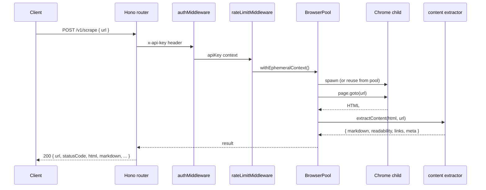

# Architecture

BrowseFleet is one Node process that manages a pool of Chrome child processes and exposes them over HTTP. There is no auxiliary service. State lives in SQLite. The whole thing fits on a $4-per-month VPS.

This doc describes the process model, the request lifecycle, and where state lives. For the public API surface, see [`api.md`](./api.md).

## Process model

```
┌─────────────────────────────────────────────────────────────────┐
│ Node process (server.ts)                                        │
│                                                                 │
│   Hono app (port 3000)                                          │
│     ├── HTTP routes ──┐                                         │
│     └── CDP WS proxy ─┤                                         │
│                       │                                         │
│   BrowserPool ◄───────┘                                         │
│     ├── BrowserSession 1  ──► chrome --headless --remote-debug…│
│     ├── BrowserSession 2  ──► chrome --headless --remote-debug…│
│     └── BrowserSession N  ──► chrome --headless --remote-debug…│
│                                                                 │
│   SQLite (better-sqlite3, WAL)                                  │
│     ├── api_keys                                                │
│     ├── sessions                                                │
│     ├── api_calls                                               │
│     ├── daily_usage                                             │
│     └── profiles                                                │
└─────────────────────────────────────────────────────────────────┘
```

One process. One port (3000 by default). One SQLite file. Each browser session is a child Chrome process spawned by `puppeteer-extra`, attached over CDP, and torn down on release. The `BrowserPool` caps the active count at `MAX_CONCURRENT_SESSIONS` (default 30).

## Request lifecycle

A typical scrape request:



`withEphemeralContext` is the contract for one-shot endpoints (`/v1/scrape`, `/v1/screenshot`, `/v1/pdf`). It leases an isolated browser context, runs the caller's function, and releases the context. For persistent sessions, the caller creates a session explicitly via `POST /v1/sessions` and references it by id for all subsequent calls.

## The CDP proxy

`POST /v1/sessions` returns a `cdpUrl` of the form `ws://<host>:3000/cdp/<sessionId>`. Clients connect a Playwright `chromium.connect()` or `puppeteer.connect()` to that URL. The server proxies the WebSocket transparently to the underlying Chrome's DevTools endpoint, with timing-safe API key auth on connect.

This is the escape hatch. Anything the high-level endpoints do not cover, the caller can do directly over CDP.

## State, where it lives, and lifetime

| What | Where | Lifetime |
|------|-------|----------|
| API keys | `api_keys` table | persists |
| Session metadata while running | `BrowserSession` in memory | until release or process exit |
| Session audit log after release | `sessions` table | persists |
| Per-request audit | `api_calls` table | persists |
| Daily roll-ups | `daily_usage` table | persists |
| Profile metadata | `data/profiles/<id>/meta.json` on disk | persists |
| Profile Chrome user data | `data/profiles/<id>/chrome/` filesystem | persists |
| Rate-limit counters | in-process memory | resets every 1 s; lost on restart |
| Temp uploads | `/tmp/bf-uploads-<sessionId>/` | until session release |
| Temp downloads | `/tmp/bf-downloads-<sessionId>/` | until session release |

The schema includes a `profiles` SQLite table that is currently unused; profile metadata is read from and written to the per-profile `meta.json` file instead. The table is reserved for a future migration.

SQLite runs in WAL mode for write throughput. A single file at `./data/browsefleet.db` is the entire database. Back it up by stopping the server and copying the file, or use `sqlite3 .backup`.

## Graceful shutdown

On `SIGTERM` or `SIGINT`:

1. The HTTP server stops accepting new connections.
2. `BrowserPool.shutdown()` releases every active session, which kills each Chrome child cleanly.
3. SQLite WAL is flushed and the file handle closed.
4. The process exits 0.

Active session releases run in parallel. A pool of 30 sessions typically drains in 2 to 5 seconds.

## What is not in the architecture

- No external queue. Requests are handled in-process; the pool is the bounded resource.
- No external cache. There is no Redis. If you need caching, put it in front.
- No multi-tenant isolation beyond API key + profile separation. Treat the host as belonging to one trust domain.
- No clustering. One process per host. To scale horizontally, run multiple BrowseFleet hosts behind a load balancer and route to a specific host by sticky session (because session ids are local to one host).

## See also

- [API reference](./api.md), the public surface.
- [Operator mode](./operator-mode.md), human-in-the-loop sessions.
- [Profiles](./profiles.md), persistent user-data directories.
- [Deployment](./deployment.md), how to run this in production.
